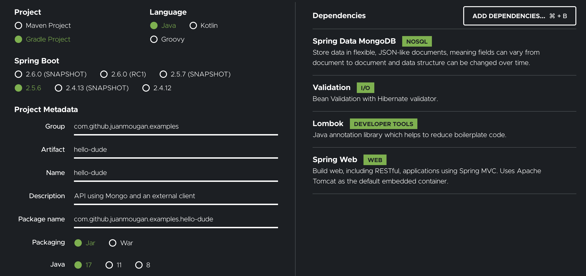

# hello-dude

Hello World using Mongo plus an external API

## Installation

1. SDKman
2. Java 17

### Boilerplate

### IDE support

1. Google style: https://github.com/google/styleguide/blob/gh-pages/intellij-java-google-style.xml
2. Add `final` all over the place: https://stackoverflow.com/questions/29891467/how-to-setup-intellij-idea-14-to-add-final-keyword-where-possible

## PoC ideas

1. Consume an external API, like GitHub's
2. Store the data in MongoDB with Spring Data
3. Input validation

## Useful resources

- Validations in Spring
  - Javax validators: https://spring.io/guides/gs/validating-form-input/
  - Using Hibernate: https://www.baeldung.com/spring-boot-bean-validation
  - Custom validators: https://www.baeldung.com/spring-mvc-custom-validator
  - WebClient: https://www.baeldung.com/spring-5-webclient
    - Or Feign? https://github.com/OpenFeign/feign
- Spring Data MongoDB: https://www.baeldung.com/spring-data-mongodb-tutorial
- REST API: https://spring.io/guides/tutorials/rest/
- Liquibase: https://www.baeldung.com/liquibase-refactor-schema-of-java-app
- TODO testing
